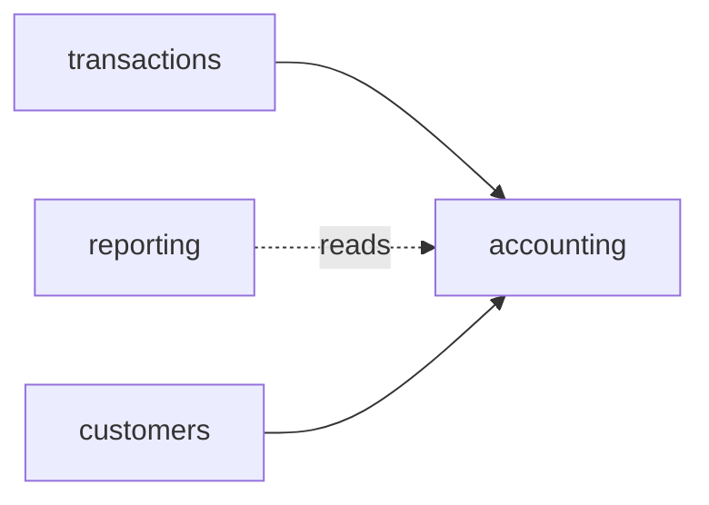

# ebank

<!-- sbce:generated:start — projection of the specs; do not edit; `apply` regenerates from the system doc + per-BC package docs -->
> A banking API of cooperating business components for account creation, transaction processing, and reporting.

**Vision:** A banking core so simple and observable that every behavior is explainable from the code alone.

## Capabilities
- **accounting** — own the account lifecycle: initial creation with validation and balance lookup · [`spec`](ebank/src/main/java/airhacks/ebank/accounting/package-info.java)
- **transactions** — apply deposit and debit transactions to existing accounts · [`spec`](ebank/src/main/java/airhacks/ebank/transactions/package-info.java)
- **reporting** — read-only extraction of account data for administrative oversight · [`spec`](ebank/src/main/java/airhacks/ebank/reporting/package-info.java)
- **customers** — own the customer lifecycle and the ownership of accounts · [`spec`](ebank/src/main/java/airhacks/ebank/customers/package-info.java)

## Components
<!-- projection of the system doc's ## Components wiring; never inferred from code -->

<!-- sbce:generated:end -->

A banking API implemented with MicroProfile, powered by Quarkus, demonstrating Java 25 features. The business components above are specified and converged with the spec-driven BCE workflow (SBCE): each `package-info.java` is the boundary contract, and every requirement statement traces to a test.


## Architecture Philosophy

The application follows the [Boundary-Control-Entity (BCE/ECB) pattern](https://bce.design) pattern to maintain clear separation of concerns. 

## Development Setup

### PostgreSQL Database

Use the provided script for quick database setup:
```bash
./runDB.sh
```

Or manually:
```bash
docker pull postgres
docker run --rm --name ebank-postgres -e POSTGRES_USER=ebank -e POSTGRES_DB=ebankdb -e POSTGRES_PASSWORD=ebanksecret -p 5432:5432 -d postgres
```

### Application Start
```bash
cd ebank
mvn quarkus:dev
```

### System Testing

Run against a freshly started application (dev mode recreates the schema on start — see [ebank-st](ebank-st/README.md)):
```bash
cd ebank-st
mvn verify
```

## Technology Stack

- **Quarkus**: Supersonic subatomic Java framework optimized for cloud deployments
- **PostgreSQL**: Popular relational database for transaction consistency
- **Jakarta Persistence (JPA)**: Standard ORM for domain object mapping
- **Jakarta REST**: RESTful web services following industry standards
- **MicroProfile Health**: Production-ready health check endpoints
- **MicroProfile OpenAPI**: Schema annotations for API documentation

## Conventions

This project demonstrates several Java and architectural conventions:

### Architecture & Design
- **BCE/ECB Pattern**: [Boundary-Control-Entity pattern](https://bce.design) for clear separation of concerns
- **Package by Feature**: Components organized by business domain (accounting, transactions, reporting, customers, logging)
- **Domain-Driven Package Naming**: Packages named after their responsibilities, not technical layers
- **Custom Stereotype Annotations**: `@Boundary` annotation combining `@ApplicationScoped` and `@Transactional`

### Code Organization
- **Capability Specs**: each BC's `package-info.java` carries its EARS requirements as the boundary contract (SBCE)
- **Requirements Traceability**: generated per-BC `@Requirement` annotation binds boundary methods and tests to statement ids
- **Package-Private Visibility**: Preferred over private fields
- **Meaningful Names**: Classes named after responsibilities, avoiding generic suffixes (*Impl, *Service, *Manager)

### Java 25 Features
- **Records**: Immutable data carriers (`AccountCreationResult`, `OwnershipResult`)
- **Sealed Interfaces**: `Transaction` and result types with controlled implementations
- **Pattern Matching**: Enhanced switch expressions with unnamed patterns for type-safe handling
- **Markdown Doc Comments**: `///` (JEP 467) package docs render the specs via javadoc
- **var Keyword**: Local variable type inference for cleaner code


### REST API Design
- **JAX-RS Resources**: REST endpoints with HTTP verbs
- **Response Builders**: Centralized response creation with status codes
- **OpenAPI Annotations**: Schema definitions for API documentation

### Persistence & Data Access
- **JPA Entities**: Simple entities with public fields
- **EntityManager Usage**: Direct use via `@PersistenceContext`
- **JDBC for Reporting**: Direct JDBC usage in reporting component for optimized read operations
- **Optional Pattern**: Consistent use of `Optional` for nullable returns
- **Factory Methods**: Static factory methods in entities

### Dependency Injection
- **CDI Integration**: Jakarta CDI with `@Inject` for dependencies
- **Custom Logger**: Centralized `EBLog` component for logging

### Functional Programming
- **Stream API**: Preference for streams over traditional loops
- **Method References**: Used instead of verbose lambda expressions
- **Immutable Results**: Result types as records

### Testing
- **AssertJ Library**: Fluent assertions instead of JUnit assertions
- **Requirement-Traced Tests**: one parameterized test per requirement group, one row per statement id (`R1.1`, …)
- **Essential Tests Only**: Avoiding repetitive tests, focusing on core functionality
- **System Tests**: black-box suite in [ebank-st](ebank-st/README.md), suffix "IT", executed by Failsafe

### Code Quality Principles
- **KISS**: Keep It Simple - simplest possible solutions
- **YAGNI**: You Aren't Gonna Need It - no over-engineering
- **High Cohesion**: Classes with single, well-defined responsibilities
- **Low Coupling**: Minimal dependencies between components
